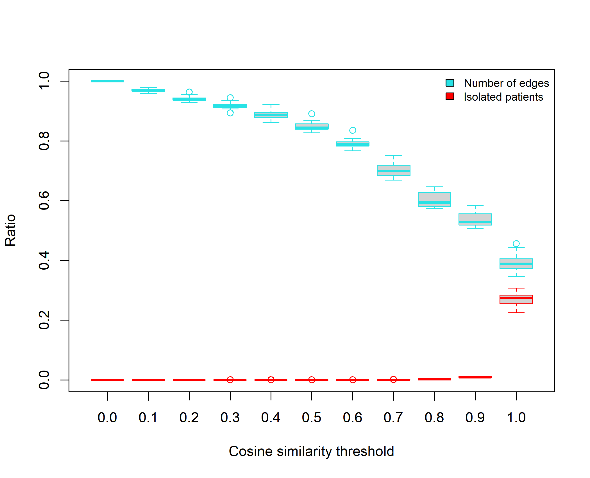
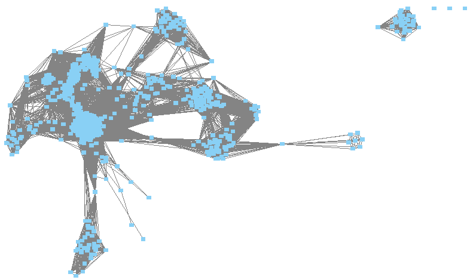
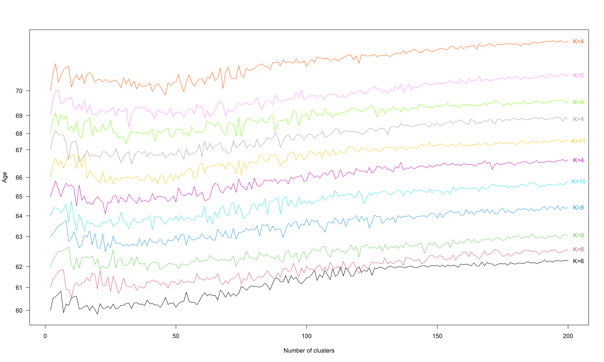
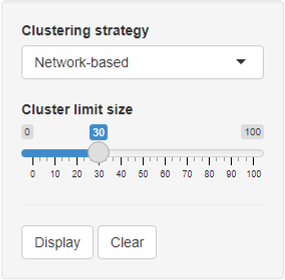

# Cluster-tracking approach

We propose two novel approaches based on cluster-tracking for clustering patients from longitudinal data extracted from medico-administrative databases. These approaches start by identifying clusters of patients at each considered age. To this goal, we used two different clustering strategies: the Markov Cluster algorithm (MCL) applied to patient networks built from raw data and Kmeans applied directly to raw data. Clusters are then tracked over ages to define cluster-trajectories. We applied our approaches to the analysis of antithrombotic drug reimbursements extracted from the Échantillon Généraliste des Bénéficiaires (EGB, a French cohort) between 2008 and 2018 in patients aged from 60 to 70 years old. For privacy reasons, this raw dataset cannot be shared publicly. Hence, from this raw dataset, we created a simulated dataset of 5594 patients with their drug reimbursements. This simulated sample dataset is used in the following to apply our two cluster-tracking approaches.

## Identifying clusters of patients from patient networks

The first clustering strategy used to identify clusters of patients relies on the construction of patient networks. We started by constructing a patient network for each age considered. We then applied the MCL clustering algorithm on each network [^1].

### Constructing patient networks

A patient network is a graph $G = (V,E)$ with $V$ patient nodes and $E$ edges representing interactions between patient nodes. We built a network for each patient age. Each network is constructed using a similarity matrix. In this similarity matrix, we computed the similarity between patients of the same age using the Cosine similarity. See `construct_similarity_matrix()` function in function in `src/python/cluster_tracking.py` for more details.

We then filtered the similarity matrices according to a threshold. This threshold is chosen in order to reduce the number of edges in the networks while obtaining a minimum number of isolated patients. From the matrices constructed with the simulated sample, we choose a threshold of 0.7 because this is the threshold for which we observe the fastest decrease in the number of edges and there is only a small number of isolated patients (see figure below).

From each filtered matrix, we obtained a patient network in which patients are connected only if they have a Cosine similarity $\ge 0.7$. The patient network containing 60-year-old patients is represented in the figure below.

### Clustering patient networks

We applied the Markov Cluster algorithm (MCL) on the largest connected component of each patient network constructed, see `cluster_patient_network()` function in `src/python/cluster_tracking.py` for more details.

## Identifying clusters of patients from raw data

The second clustering strategy used to identify clusters of patients relies on raw data. We used Kmeans that we applied directly to raw data, for each patient age. As in Kmeans the number of clusters must be specified *a priori*, we determined the optimal number of clusters per age by calculating the silhouette score. We varied the number of clusters from 2 to 200. The optimal number of clusters $K$ identified at each age from the simulated sample is represented in the figure below.

We can therefore apply Kmeans at each age with the optimal number of clusters identified, see `cluster_raw_data()` in `src/python/cluster_tracking.py` for more details.

## Tracking clusters over ages

We identified sets of clusters per age either from patient networks with MCL or from raw data with Kmeans. We then intend to follow the clusters over the different ages. To this goal, we computed the number of common patients between every pair of clusters obtained at 2 consecutive ages. By considering only the largest number of common patients between all consecutive clusters, we were able to identify sets of successive clusters that we called cluster-trajectories.

## R Shiny app

To visualize the tracking of clusters and the cluster-trajectories from the simulated data, we developed an R Shiny app. The tracking of clusters is visualized using an alluvial plot, in which the blocks represent the clusters and the stream fields between the blocks represent the number of common patients. The cluster-trajectories are visualized using a flowchart composed of blocks representing the clusters. The arrow thickness between the blocks represents the number of common patients. All clusters displayed in the flowchart are characterized by the two most used drugs (name, percentage of patients receiving the drug), the sex ratio (SR) and the total number of patients (n). These clusters are named with the age at which it was identified and its label (age.label).

This R shiny app allows to choose between the two clustering strategies and to display clusters greater than or equal to the selected limit size. The following code should be executed in R to launch the application (see `docs/development-environment.md` for informations on how to run the app)

[^1]: Santo Fortunato. "Community detection in graphs". In: Physics reports 486.3-5 (2010), pp. 75–174.
